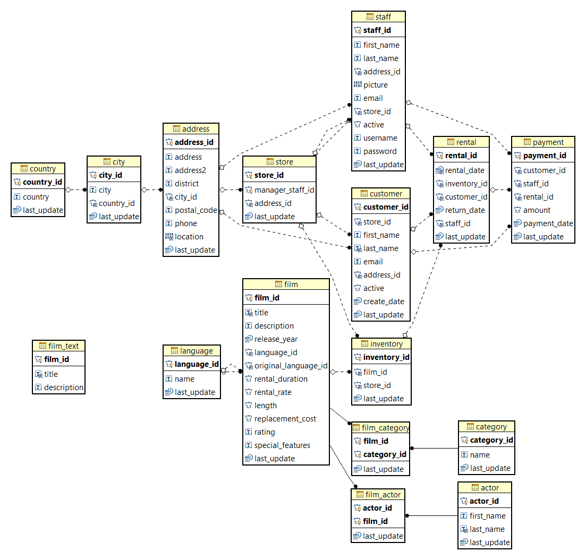

# Generate ER diagram

Review the diagram.



# DML
Data manipulation language operations are:

- SELECT
- INSERT
- UPDATE

## SELECT

```sql
SELECT A1, A2, A3..., An
FROM T1, T2, T3,..., Tn
WHERE condition
```

### Operators in The WHERE Clause

| Comparison Operator | Description                                           |
|---------------------|-------------------------------------------------------|
| =                   | Equal                                                 |
| <=>                 | Equal (MySql, safe to compare NULL values)            |
| <>                  | Not Equal                                             |
| !=                  | Not Equal                                             |
| >                   | Greater Than                                          |
| >=                  | Greater Than or Equal                                 |
| <                   | Less Than                                             |
| <=                  | Less Than or Equal                                    |
| BETWEEN             | Within a range (inclusive)                            |
| NOT                 | Negates a condition                                   |
| IS NULL             | NULL value                                            |
| IS NOT NULL         | Non-NULL value                                        |
| LIKE                | Pattern matching with % and _                         |
| IN ( )              | Matches a value in a list                             |
| EXISTS              | Condition is met if subquery returns at least one row |

# Simple queries

## Conditions
```sql
SELECT title, rating, length
FROM film
WHERE length > 100;
```
```sql
SELECT title, `length` FROM film
WHERE `length` BETWEEN 100 AND 120;
```

## Mutilple Tables
```sql
SELECT city, district
FROM address, city
WHERE address.city_id = city.city_id;
```

## Adding distinct
```sql
SELECT [DISTINCT] country, city
FROM address, city, country
WHERE address.city_id = city.city_id
AND city.country_id = country.country_id;
```

## Conditions with columns in different tables 
```sql
SELECT title, name
FROM film, `language`
WHERE film.language_id = language.language_id
AND film.`length` > 100 AND language.name = 'English'
```

## Ambigous column names
```sql
SELECT title, category_id
 FROM film, film_category, category
WHERE film.film_id = film_category.film_id 
  AND film_category.category_id = category.category_id
``` 

## Adding Order BY
```sql
SELECT title, special_features, rental_rate, name
 FROM film, film_category, category
WHERE film.film_id = film_category.film_id 
  AND film_category.category_id = category.category_id
ORDER BY rental_rate DESC
```
### More than one column
```sql
SELECT title, special_features, rental_rate, name
 FROM film, film_category, category
WHERE film.film_id = film_category.film_id 
  AND film_category.category_id = category.category_id
ORDER BY rental_rate DESC, special_features ASC
```
## Using Limit
```sql
SELECT * FROM actor
LIMIT 10;
```

## Like

| Wildcard | Explanation                                                          |
|----------|----------------------------------------------------------------------|
| %        | Allows you to match any string of any length (including zero length) |
| _        | Allows you to match on a single character                            |

```sql
SELECT *
FROM film
WHERE special_features LIKE '%Trailers%'
```
When searching for characters _ %, they have to be escaped with \ (default escape character)

```sql
SELECT * FROM address
WHERE address LIKE '%\_%';
```
## Arithmetics
```sql
SELECT title, description, rental_rate * 150 AS "In Pesos" 
FROM film
```
