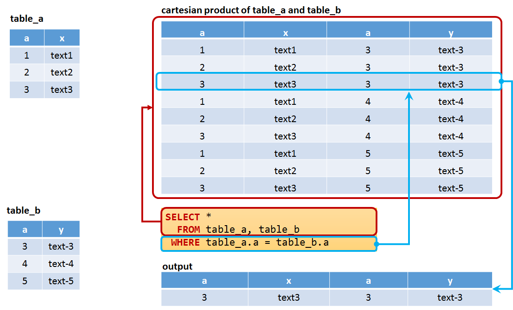
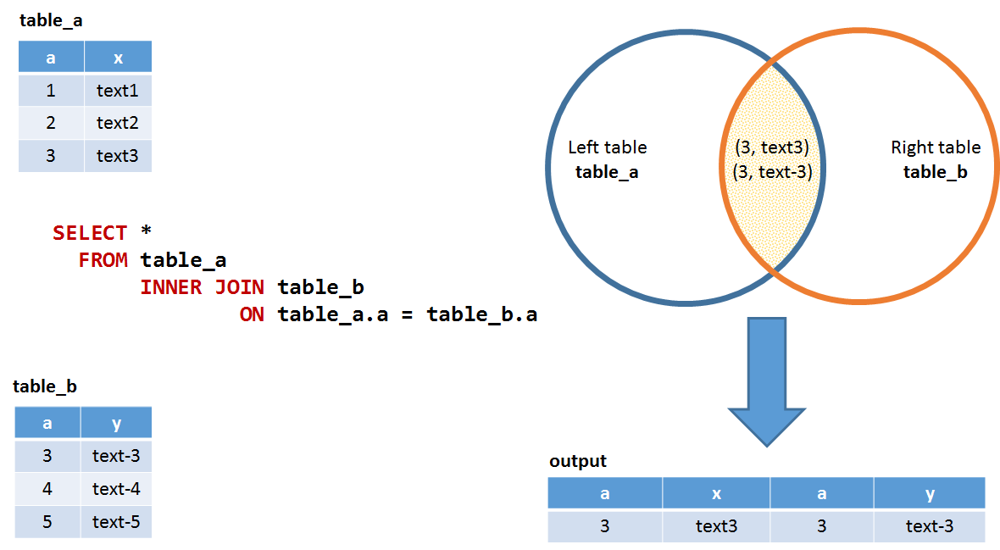
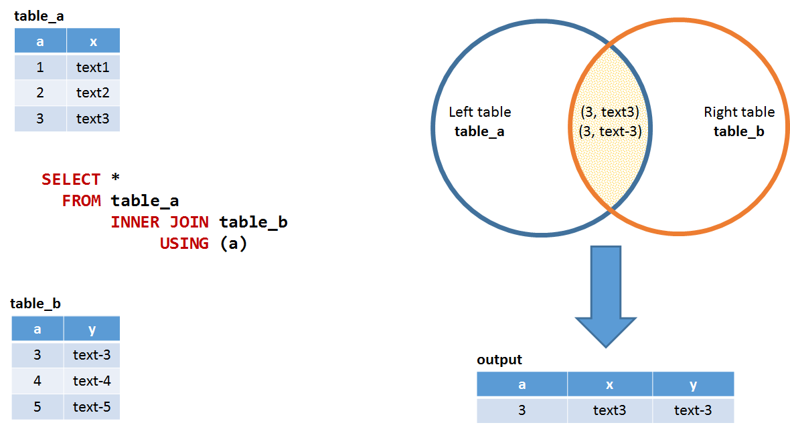
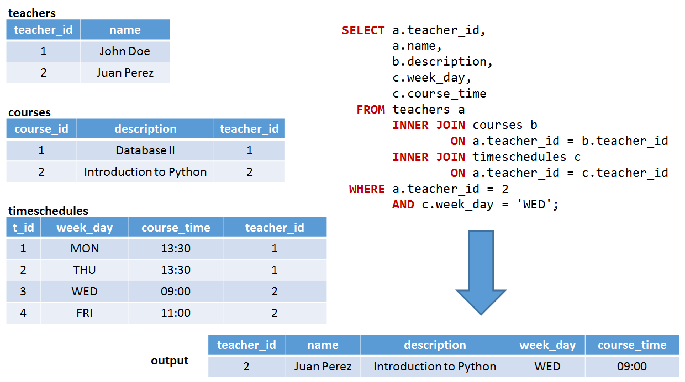
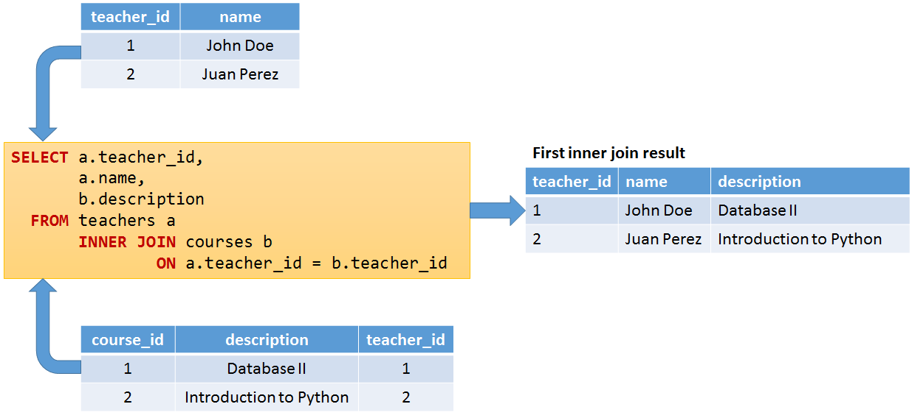
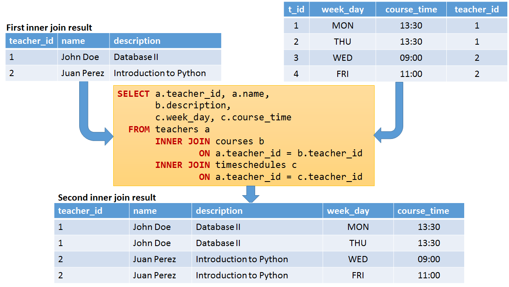
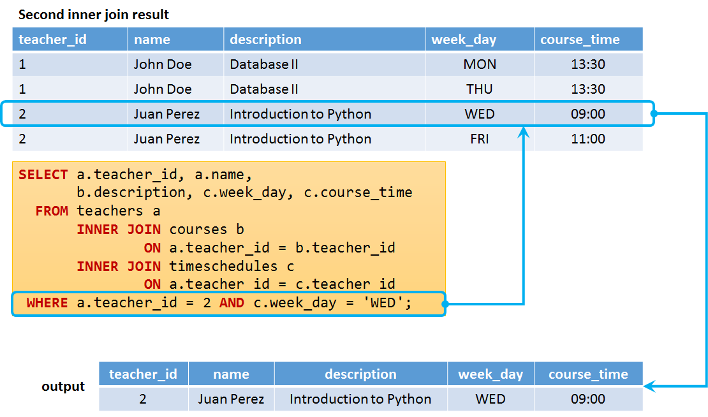
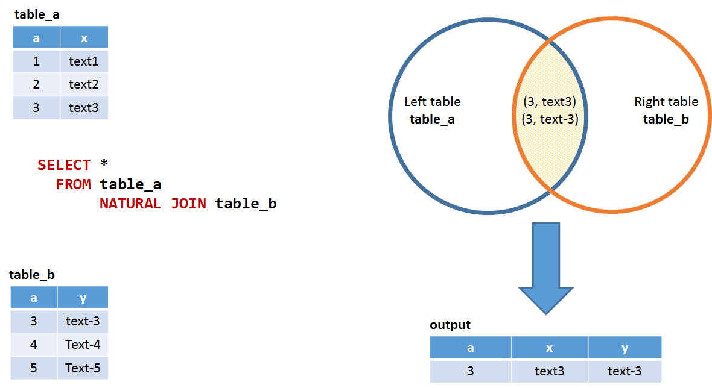
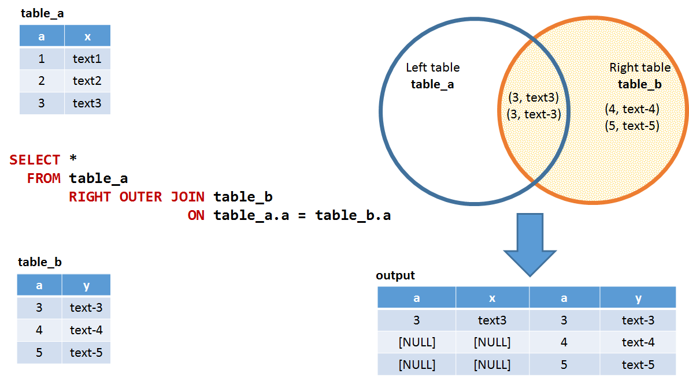

## CARTESIAN PRODUCT
This is what we saw in previous classes to get results from multiple tables



## INNER JOIN

[INNER] JOIN selects all rows from both participating tables to appear in the result if and only if both tables meet the conditions specified in the ON clause.

### ON clause



Example (analyze with explain plan):

```sql
SELECT *
  FROM film
      INNER JOIN `language`
              ON film.language_id = `language`.language_id;
              
-- Try this              
SELECT * 
  FROM `language`, film 
 WHERE film.language_id = `language`.language_id 
```

Discuss results.

### Using clause

When column names match in both tables the USING clause can be used.



Example

```sql
SELECT *
  FROM film
      INNER JOIN `language`
           USING (language_id)
```

### INNER JOIN with alias

Table names can be defined and used like this:

Example

```sql
SELECT *
  FROM film AS f
      INNER JOIN `language` AS l
              ON f.language_id = l.language_id
```              

### INNER JOIN using three tables



### First part



### Second part



### Final Result


Example:

```sql
SELECT * 
  FROM film 
       INNER JOIN film_category 
               ON film.film_id = film_category.film_id 
       INNER JOIN category 
               ON film_category.category_id = category.category_id; 

-- same?
SELECT *
  FROM film, film_category, category
 WHERE film.film_id = film_category.film_id
   AND film_category.category_id = category.category_id;               

-- with using
SELECT * 
  FROM film 
       INNER JOIN film_category 
            USING ( film_id ) 
       INNER JOIN category 
            USING ( category_id );               

```

## NATURAL JOIN

NATURAL JOIN is such a join that performs the same task as an INNER (or LEFT JOIN), in which the ON or USING clause refers to all columns that the tables to be joined have in common.

The MySQL NATURAL JOIN is structured in such a way that, columns with the same name of associate tables will appear once only.

1. The associated tables have one or more pairs of identically named columns.
2. The columns must be the same data type.
3. Don’t use ON clause in a NATURAL JOIN.




Example:

```sql
SELECT *
  FROM film
      NATURAL JOIN `language`
```

What is going on here?


## Some examples

```sql
-- find films pairs with same duration
SELECT f1.title, f2.title, f1.`length` 
  FROM film f1, film f2
 WHERE f1.`length` = f2.`length` AND f1.film_id < f2.film_id;

-- with join
SELECT f1.title, f2.title, f1.`length` 
  FROM film f1 
       INNER JOIN film f2 USING(`length`)
WHERE f1.film_id < f2.film_id
```

```sql
-- natural join the same table... ???
SELECT *
  FROM actor a1
       NATURAL JOIN actor a2
```


## LEFT OUTER JOIN
LEFT [OUTER] JOIN joins two tables and fetches rows based on a condition, which match in both tables and including the unmatched rows from the table written before the JOIN clause.


Example:

```sql
-- add a new copy of ACADEMY DINOSAUR to store 1
INSERT INTO inventory
(film_id, store_id, last_update)
VALUES(1, 1, '2017-02-15 05:09:17.000');

-- this shows what?
SELECT title, rental.*
  FROM film
       INNER JOIN inventory USING (film_id)       
       LEFT OUTER JOIN rental USING (inventory_id)
WHERE store_id = 1 
AND film_id = 1;
```

## RIGHT OUTER JOIN

RIGHT [OUTER] JOIN joins two tables and fetches rows based on a condition, which match in both tables and including the unmatched rows available from the table written after the JOIN clause.


