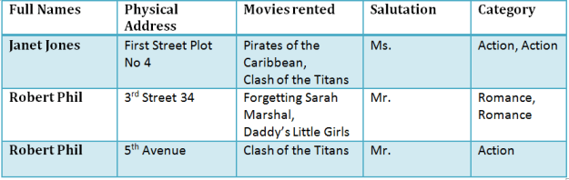

## What is Normalization?
Normalization is a database design technique which organizes tables in a manner that reduces redundancy and dependency of data.

## Database Normalization Examples 
Assume a video library maintains a database of movies rented out. Without any normalization, all information is stored in one table as shown below.

Here you see Movies Rented column has multiple values.

