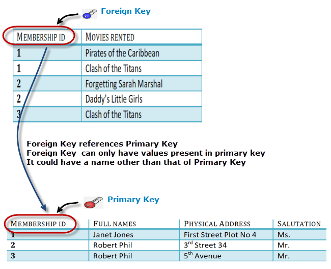
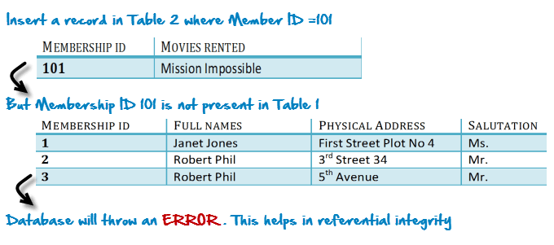

## What is Normalization?
Normalization is a database design technique which organizes tables in a manner that reduces redundancy and dependency of data.

## Database Normalization Examples 
Assume a video library maintains a database of movies rented out. Without any normalization, all information is stored in one table as shown below.

Here you see Movies Rented column has multiple values.

## Database Normal Forms

Now let's move into 1st Normal Forms

#### 1NF (First Normal Form) Rules
- Each table cell should contain a single value.
- Each record needs to be unique.

The above table in 1NF-

1NF Example

#### What is a KEY?
A KEY is a value used to identify a record in a table uniquely. A KEY could be a single column or combination of multiple columns

Note: Columns in a table that are NOT used to identify a record uniquely are called non-key columns.

#### What is a Primary Key?

A primary is a single column value used to identify a database record uniquely.

It has following attributes

- A primary key cannot be NULL
- A primary key value must be unique
- The primary key values cannot be changed
- The primary key must be given a value when a new record is inserted.

#### What is Composite Key?
A composite key is a primary key composed of multiple columns used to identify a record uniquely

In our database, we have two people with the same name Robert Phil, but they live in different places.

Hence, we require both Full Name and Address to identify a record uniquely. That is a composite key.

## 2NF (Second Normal Form) Rules
- Rule 1- Be in 1NF
- Rule 2- Single Column Primary Key

It is clear that we can't move forward to make our simple database in 2nd Normalization form unless we partition the table above.

Table: members

Table: rentals

We have divided our 1NF table into two tables, members and rentals. Members contains member information. Rentals contains information on movies rented.

We have introduced a new column called Membership_id which is the primary key for **members**. Records can be uniquely identified in **members** using membership id

#### Database - Foreign Key

In rentals, Membership_ID is the Foreign Key

* Foreign Key references the primary key of another Table! It helps connect your Tables
* A foreign key can have a different name from its primary key
* It ensures rows in one table have corresponding rows in another
* Unlike the Primary key, they do not have to be unique. Most often they aren't
* Foreign keys can be null even though primary keys can not 

Why do you need a foreign key?

Suppose someone inserts a record in Table B such as

You will only be able to insert values into your foreign key that exist in the unique key in the parent table. This helps in referential integrity. 

The above problem can be overcome by declaring membership id  from **rentals** as foreign key of membership id from **members**

Now, if somebody tries to insert a value in the membership id field that does not exist in the parent table, an error will be shown!

#### What are transitive functional dependencies?

A transitive functional dependency is when changing a non-key column, might cause any of the other non-key columns to change

Consider the **members** table Changing the non-key column Full Name may change Salutation.

### 3NF (Third Normal Form) Rules

- Rule 1- Be in 2NF
- Rule 2- Has no transitive functional dependencies

To move our 2NF table into 3NF, we again need to again divide our table.

#### 3NF Example

We have again divided our tables and created a new table which stores Salutations. 

There are no transitive functional dependencies, and hence our table is in 3NF

In **salutations** table Salutation ID is primary key, and in **members** Salutation ID is foreign to primary key in **salutations**

### Extracted from https://www.guru99.com/database-normalization.html