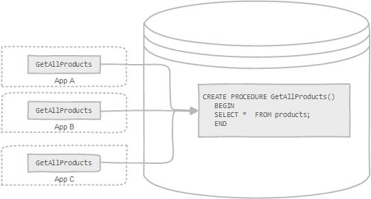

# Definition of stored procedures

A stored procedure is a segment of declarative SQL statements stored inside the database catalog. A stored procedure can be invoked by triggers, other stored procedures, and applications such as Java, Python, PHP, etc.



A stored procedure that calls itself is known as a recursive stored procedure. Most database management systems support recursive stored procedures. However, MySQL does not support it very well. You should check your version of MySQL database before implementing recursive stored procedures in MySQL.

# Stored Procedures in MySQL

MySQL is known as the most popular open source RDBMS which is widely used by both community and enterprise. However, during the first decade of its existence, it did not support stored procedures, stored functions, triggers, and events. Since MySQL version 5.0, those features were added to MySQL database engine to make it more flexible and powerful.

## MySQL stored procedures advantages

* Typically stored procedures help increase the performance of the applications. Once created, stored procedures are compiled and stored in the database. However, MySQL implements the stored procedures slightly different. MySQL stored procedures are compiled on demand. After compiling a stored procedure, MySQL puts it into a cache. And MySQL maintains its own stored procedure cache for every single connection. If an application uses a stored procedure multiple times in a single connection, the compiled version is used, otherwise, the stored procedure works like a query.
* Stored procedures help reduce the traffic between application and database server because instead of sending multiple lengthy SQL statements, the application has to send only name and parameters of the stored procedure.
* Stored procedures are reusable and transparent to any applications. Stored procedures expose the database interface to all applications so that developers don’t have to develop functions that are already supported in stored procedures.
* Stored procedures are secure. The database administrator can grant appropriate permissions to applications that access stored procedures in the database without giving any permissions on the underlying database tables.
* Besides those advantages, stored procedures have their own disadvantages, which you should be aware of before using them in your databases.

## MySQL stored procedures disadvantages

* If you use a lot of stored procedures, the memory usage of every connection that is using those stored procedures will increase substantially. In addition, if you overuse a large number of logical operations inside store procedures, the CPU usage will also increase because the database server is not well-designed for logical operations.
* Constructs of stored procedures make it more difficult to develop stored procedures that have complicated business logic.
* It is difficult to debug stored procedures. Only a few database management systems allow you to debug stored procedures. Unfortunately, MySQL does not provide facilities for debugging stored procedures.
* It is not easy to develop and maintain stored procedures. Developing and maintaining stored procedures are often required a specialized skill set that not all application developers possess. This may lead to problems in both application development and maintenance phases.

MySQL stored procedures have their own advantages and disadvantages. When you develop applications, you should decide whether you should or should not use stored procedure based on the business requirements.


# Getting Started with MySQL Stored Procedures

### Writing the first MySQL stored procedure

We are going to develop a simple stored procedure named GetAllProducts()  to help you get familiar with the syntax. The GetAllProducts()  stored procedure selects all products from the products  table.

Launch the mysql client tool and type the following commands:
```sql
 DELIMITER //
 CREATE PROCEDURE GetAllProducts()
   BEGIN
   SELECT *  FROM products;
   END //
 DELIMITER ;
```

Let’s examine the stored procedure in greater detail:

* The first command is DELIMITER // , which is not related to the stored procedure syntax. The DELIMITER statement changes the standard delimiter which is semicolon ( ; ) to another. In this case, the delimiter is changed from the semicolon( ; ) to double-slashes // Why do we have to change the delimiter? Because we want to pass the stored procedure to the server as a whole rather than letting MySQL tool interpret each statement at a time.  Following the END keyword, we use the delimiter //  to indicate the end of the stored procedure. The last command ( DELIMITER; ) changes the delimiter back to the semicolon (;).
* We use the **CREATE PROCEDURE**  statement to create a new stored procedure. We specify the name of stored procedure after the **CREATE PROCEDURE**  statement. In this case, the name of the stored procedure is GetAllProducts . We put the parentheses after the name of the stored procedure.
* The section between **BEGIN** and **END**  is called the body of the stored procedure. You put the declarative SQL statements in the body to handle business logic. In this stored procedure, we use a simple SELECT statement to query data from the products table.


# Calling stored procedures

In order to call a stored procedure, you use the following SQL command:

```sql
CALL STORED_PROCEDURE_NAME();
```

You use the CALL  statement to call a stored procedure e.g., to call the GetAllProducts()  stored procedure, you use the following statement:

```sql
CALL GetAllProducts();
```

If you execute the statement above, you will get all products in the products table.

# MySQL Stored Procedure Variables

A variable is a named data object whose value can change during the stored procedure execution. We typically use the variables in stored procedures to hold the immediate results. These variables are local to the stored procedure.

You must declare a variable before you can use it.

### Declaring variables

To declare a variable inside a stored procedure, you use the DECLARE  statement as follows:

```sql
DECLARE variable_name datatype(size) DEFAULT default_value;
```

Let’s examine the statement above in more detail:

* First, you specify the variable name after the DECLARE keyword. The variable name must follow the naming rules of MySQL table column names.
* Second, you specify the data type of the variable and its size. A variable can have any MySQL data types such as INT, VARCHAR , DATETIME , etc.
* Third, when you declare a variable, its initial value is NULL. You can assign the variable a default value using the DEFAULT keyword.

For example, we can declare a variable named   total_sale with the data type INT and default value 0  as follows:

```sql
DECLARE total_sale INT DEFAULT 0;
```

MySQL allows you to declare two or more variables that share the same data type using a single DECLARE statement as following:

```sql
DECLARE x, y INT DEFAULT 0;
```
We declared two integer variables  x and  y, and set their default values to zero.

## Assigning variables

Once you declared a variable, you can start using it. To assign a variable another value, you use the SET  statement, for example:

```sql
DECLARE total_count INT DEFAULT 0;
SET total_count = 10;
```

The value of the total_count variable is 10  after the assignment.

Besides the SET  statement, you can use the SELECT INTO  statement to assign the result of a query, which returns a scalar value, to a variable. See the following example:

```sql
DECLARE total_products INT DEFAULT 0

SELECT COUNT(*) INTO total_products
FROM products
```
In the example above:

* First, we declare a variable named total_products  and initialize its value to 0.
* Then, we used the SELECT INTO  statement to assign the total_products  variable the number of products that we selected from the products  table in the sample database.

### Variables scope

A variable has its own scope that defines its lifetime. If you declare a variable inside a stored procedure, it will be out of scope when the END statement of stored procedure reached.

If you declare a variable inside BEGIN END  block, it will be out of scope if the END is reached. You can declare two or more variables with the same name in different scopes because a variable is only effective in its own scope. However, declaring variables with the same name in different scopes is not good programming practice.

A variable that begins with the @ sign is session variable. It is available and accessible until the session ends.

# MySQL Stored Procedure Parameters

Almost stored procedures that you develop require parameters. The parameters make the stored procedure more flexible and useful. In MySQL, a parameter has one of three modes: **IN**, **OUT**, or **INOUT**.

* {+IN+} – is the default mode. When you define an IN parameter in a stored procedure, the calling program has to pass an argument to the stored procedure. In addition, the value of an IN parameter is protected. It means that even the value of the IN parameter is changed inside the stored procedure, its original value is retained after the stored procedure ends. In other words, the stored procedure only works on the copy of the IN parameter.
* {+OUT+} – the value of an OUT parameter can be changed inside the stored procedure and its new value is passed back to the calling program. Notice that the stored procedure cannot access the initial value of the OUT parameter when it starts.
* {+INOUT+} – an INOUT  parameter is the combination of IN  and OUT  parameters. It means that the calling program may pass the argument, and the stored procedure can modify the INOUT parameter and pass the new value back to the calling program.

The syntax of defining a parameter in the stored procedures is as follows:

```sql
MODE param_name param_type(param_size)
```

* The MODE could be IN , OUT,,or INOUT , depending on the purpose of the parameter in the stored procedure.
* The param_name is the name of the parameter. The name of the parameter must follow the naming rules of the column name in MySQL.
* Followed the parameter name is its data type and size. Like a variable, the data type of the parameter can be any valid MySQL data type.

Each parameter is separated by a comma (,) if the stored procedure has more than one parameter.

Let’s practice with some examples to get a better understanding. We will use the tables in the sample database for the demonstration.

## MySQL stored procedure parameter examples

#### The IN parameter example

The following example illustrates how to use the IN parameter in the GetOfficeByCountry stored procedure that selects offices located in a particular country.

```sql
DELIMITER //
CREATE PROCEDURE GetOfficeByCountry(IN countryName VARCHAR(255))
	BEGIN
		SELECT * 
 		FROM offices
 		WHERE country = countryName;
	END //
DELIMITER ;
````

The countryName is the IN parameter of the stored procedure. Inside the stored procedure, we select all offices that locate in the country specified by the countryName parameter.

Suppose, we want to get all offices in the USA, we just need to pass a value (USA) to the stored procedure as follows:

```sql
CALL GetOfficeByCountry('USA');
```

To get all offices in France, we pass the France literal string to the GetOfficeByCountry  stored procedure as follows:

```sql
CALL GetOfficeByCountry('France')
```


### The OUT parameter example

The following stored procedure returns the number of orders by order status. It has two parameters:

* orderStatus : the IN parameter that is the order status which we want to count the orders.
* total : the OUT parameter that stores the number of orders for a specific order status.

The following is the source code of the CountOrderByStatus stored procedure.

```sql
DELIMITER $$
CREATE PROCEDURE CountOrderByStatus(
 		IN orderStatus VARCHAR(25),
 		OUT total INT)
BEGIN
	SELECT count(orderNumber)
	INTO total
	FROM orders
	WHERE status = orderStatus;
END$$
DELIMITER ;
```

To get the number of shipped orders, we call the CountOrderByStatus  stored procedure and pass the order status as Shipped, and also pass an argument ( @total ) to get the return value.

```sql
CALL CountOrderByStatus('Shipped',@total);
SELECT @total;
```

To get the number of orders that are in process, we call the CountOrderByStatus stored procedure as follows:

```sql
CALL CountOrderByStatus('in process',@total);
SELECT @total AS  total_in_process;
```

## The INOUT parameter example

The following example demonstrates how to use an INOUT parameter in the stored procedure.

```sql
DELIMITER $$
CREATE PROCEDURE set_counter(INOUT count INT(4),IN inc INT(4))
BEGIN
	SET count = count + inc;
END$$
DELIMITER ;
```

How it works.

* The set_counter  stored procedure accepts one INOUT  parameter ( count ) and one IN parameter ( inc ).
* Inside the stored procedure, we increase the counter ( count ) by the value of the inc parameter.

See how we call the set_counter  stored procedure:

```sql
SET @counter = 1;
CALL set_counter(@counter,1); -- 2
CALL set_counter(@counter,1); -- 3
CALL set_counter(@counter,5); -- 8
SELECT @counter; -- 8
```